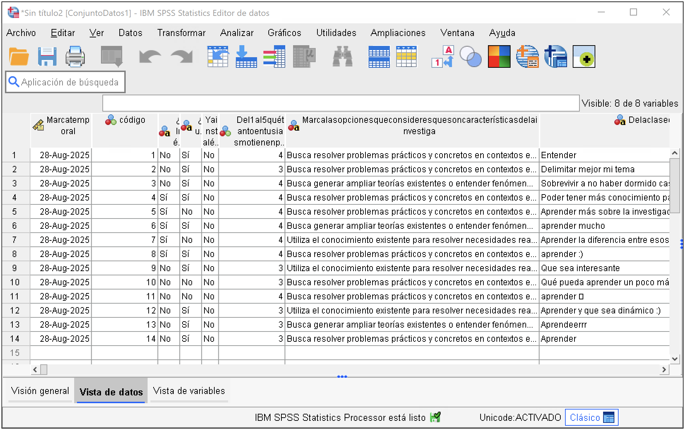

## 1. Descargar datos desde Google Forms

Desde Google Forms, haz la conexión del formulario con una Hoja de cálculo en Google Sheets. Seguidamente, descarga la base en formato Excel (`.xlsx`).

## 2. Importar datos de formato Excel

::: {.callout-tip title="TL;DR"}
Ruta en SPSS:
`Archivo > Importar datos > Excel…`
:::

1. En SPSS, abre la ruta `Archivo > Importar datos > Excel…`  
2. Ubica en el buscados tu archivo descargado con las respuestas de Google Forms (`.xlsx`)  
3. Revisa la configuración automática identificada por SPSS y haz click en `Aceptar`.

En unos segundos, verás tu conjunto de datos...

## 3. Explorar variables

::: {.callout-warning title="OJO"}
Al importar una base desde **Google Forms o Excel**, revisa que todo haya sido leído correctamente:

1. **Las respuestas se suelen importar como texto**  
   Google Forms guarda las alternativas como palabras, no como números.  
   ➜ **Deberás transformar estas variables a numéricas** antes de analizarlas.

2. **Los nombres de variables provienen de los encabezados**  
   Suelen ser largos y poco legibles pues se borran los espacios.
   ➜ Revisa la *Vista de variables* para ajustar los nombres (cortos, sin espacios, tildes ni signos).

3. **Verifica las etiquetas de valores y el formato de variables**  
   SPSS no asigna etiquetas de valores ni siempre reconoce el tipo de dato correcto.  
   ➜ Corrige estos aspectos como parte del procesamiento.
:::

Una vez importada la base, revisa la **vista de variables**:

- **Nombre:** cómo se llaman las variables  
- **Tipo:** son cadena o numéricas
- **Medida:** nominal, ordinal, escala  
- **Valores:** etiquetas de categorías  

