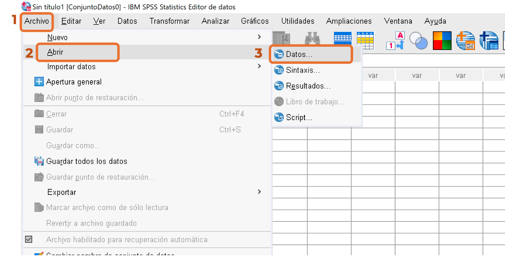
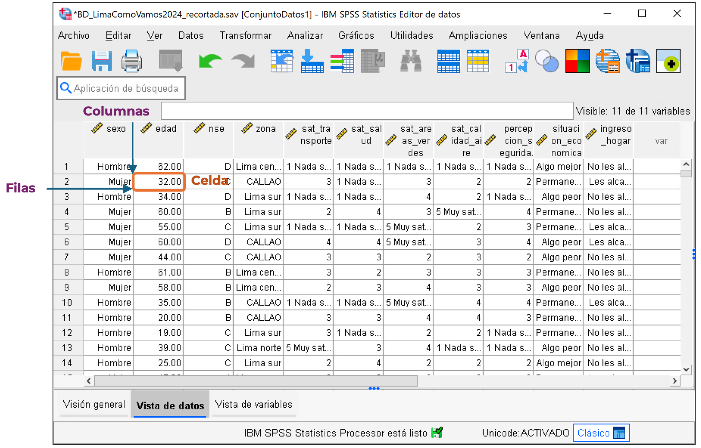
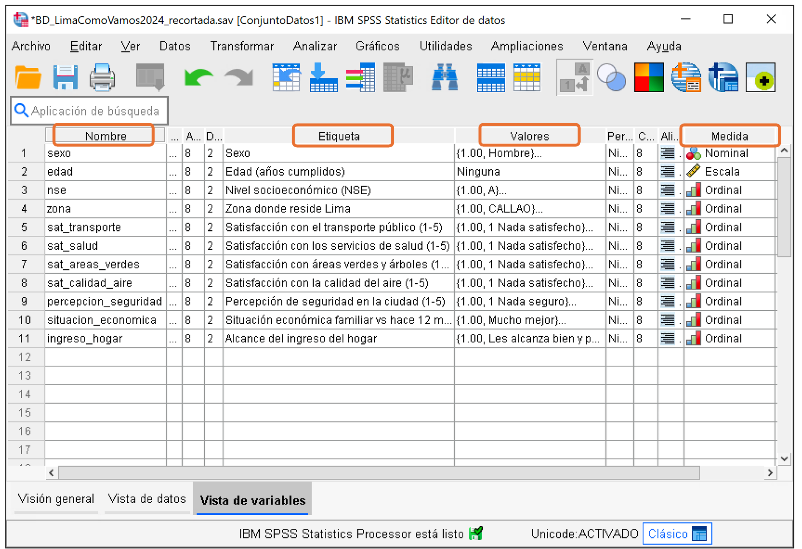
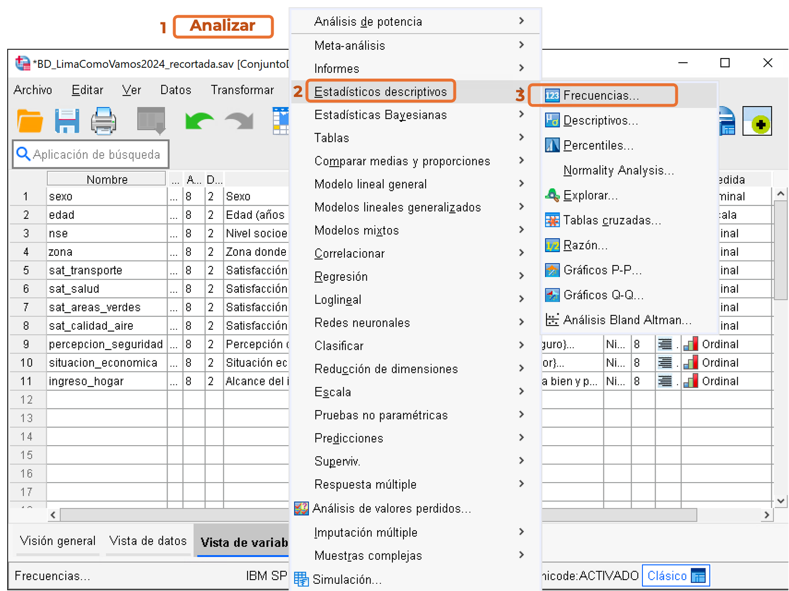
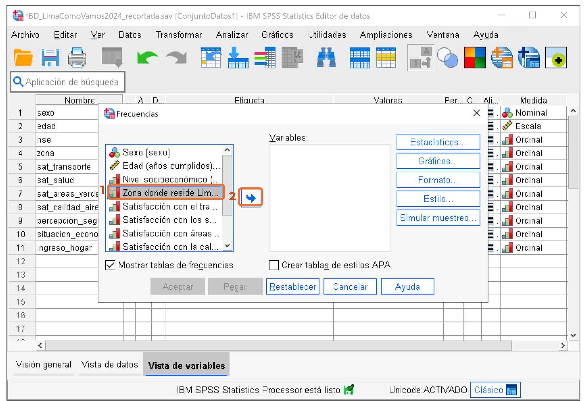
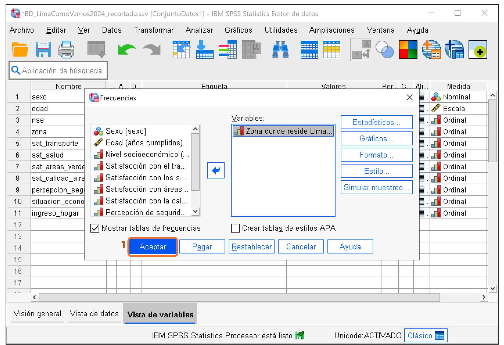
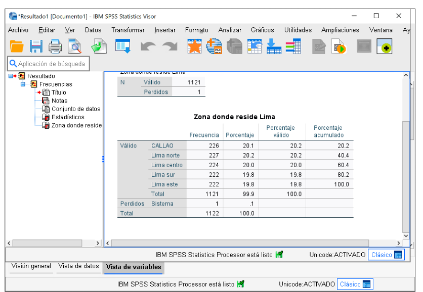

```{=html}
<style>
.carrete-slide img {
  width: 100%;
  height: 380px;
  object-fit: contain;
  background: #f7f7f7;
  border-radius: 8px;
}
.carousel-control-prev-icon,
.carousel-control-next-icon {
  background-color: rgba(0, 0, 0, 0.6);
  border-radius: 50%;
  padding: 18px;
  background-size: 55%, 55%;
}
</style>
```

::: {.callout-tip title="TL;DR"}
Abre la base recortada, revisa cómo está descrita cada variable en **Vista de Variables**, genera una tabla de frecuencias y pega tus capturas en la presentación de Drive de Paideia.
:::

## Paso 1: Descargar el archivo

Descarga `BD_LimaComoVamos2024_recortada.sav` desde **Paideia**, sección de esta semana. Guárdalo en una carpeta donde lo puedas ubicar fácilmente.

## Paso 2: Abrir la base de datos en SPSS

Abre SPSS y carga el archivo descargado (**Archivo → Abrir → Datos...**). Vas a caer en **Vista de Datos**: las columnas son variables, las filas son casos (personas encuestadas), y cada celda es el valor de una persona en una variable.

```{=html}
<div id="carouselPaso2" class="carousel slide" data-bs-ride="false">
  <div class="carousel-inner">
    <div class="carousel-item active carrete-slide">
      
    </div>
    <div class="carousel-item carrete-slide">
      
    </div>
  </div>
  <button class="carousel-control-prev" type="button" data-bs-target="#carouselPaso2" data-bs-slide="prev">
    <span class="carousel-control-prev-icon" aria-hidden="true"></span>
  </button>
  <button class="carousel-control-next" type="button" data-bs-target="#carouselPaso2" data-bs-slide="next">
    <span class="carousel-control-next-icon" aria-hidden="true"></span>
  </button>
</div>
```

## Paso 3: Explorar la Vista de Variables

Cambia a la pestaña **Vista de Variables** (abajo a la izquierda). Aquí cada fila describe una variable, no una persona: es la "base de datos de la base de datos".

Revisa en Google Slides (enlace en Paideia) la **variable asignada a tu grupo** de la base y revisa estas cuatro columnas:

- **Nombre**: el nombre corto de la variable.
- **Etiqueta**: la pregunta o descripción completa.
- **Medida**: si es nominal, ordinal o de escala.
- **Valores**: qué significa cada código numérico (ej. 1 = Hombre, 2 = Mujer).

::: {.callout-warning title="OJO"}
El código (1, 2, 3...) no tiene un significado matemático en variables nominales u ordinales — es solo una etiqueta. No se puede sacar un promedio de "sexo".
:::

```{=html}
<div id="carouselPaso3" class="carousel slide" data-bs-ride="false">
  <div class="carousel-inner">
    <div class="carousel-item active carrete-slide">
      
    </div>
  </div>
  <button class="carousel-control-prev" type="button" data-bs-target="#carouselPaso3" data-bs-slide="prev">
    <span class="carousel-control-prev-icon" aria-hidden="true"></span>
  </button>
  <button class="carousel-control-next" type="button" data-bs-target="#carouselPaso3" data-bs-slide="next">
    <span class="carousel-control-next-icon" aria-hidden="true"></span>
  </button>
</div>
```

## Paso 4: Generar una tabla de frecuencias

Ve a **Analizar → Estadísticos descriptivos → Frecuencias**, selecciona la misma variable que revisaste en el Paso 3, y genera la tabla.

```{=html}
<div id="carouselPaso4" class="carousel slide" data-bs-ride="false">
  <div class="carousel-inner">
    <div class="carousel-item active carrete-slide">
      
    </div>
    <div class="carousel-item carrete-slide">
      
    </div>
    <div class="carousel-item carrete-slide">
      
    </div>
    <div class="carousel-item carrete-slide">
      
  </div>
  <button class="carousel-control-prev" type="button" data-bs-target="#carouselPaso4" data-bs-slide="prev">
    <span class="carousel-control-prev-icon" aria-hidden="true"></span>
  </button>
  <button class="carousel-control-next" type="button" data-bs-target="#carouselPaso4" data-bs-slide="next">
    <span class="carousel-control-next-icon" aria-hidden="true"></span>
  </button>
</div>
```

## Paso 5: Entregar

En la presentación compartida de Drive (enlace en Paideia, sección de esta semana), llena la diapositiva de tu grupo con:

1. Información de tu variable en **Vista de Variables** (nombre, etiqueta, medida, valores).
2. Captura de la tabla de frecuencias del Paso 4.

