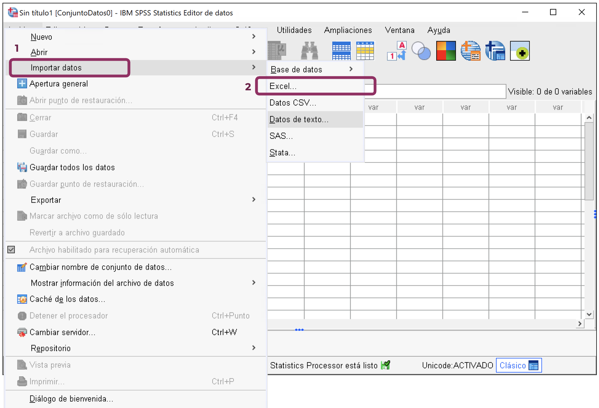
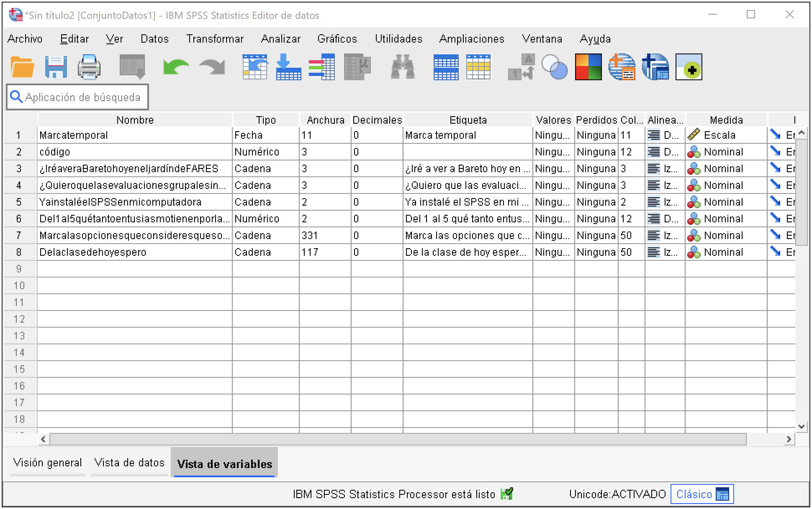

## Importar base desde Google Forms o Excel

**En SPSS:**  
`Archivo > Importar datos > Excel…`

1. Abre SPSS  
2. Ve al menú `Archivo > Importar datos > Excel…`  
3. Selecciona el archivo descargado de Google Forms (`.xlsx` o `.csv`)  
4. Revisa que SPSS identifique correctamente las variables y tipos

---

## Identificar variables

Una vez importada la base, revisa la **vista de variables**:

- **Nombre:** cómo se llamará la variable  
- **Tipo:** cadena o numérica  
- **Medida:** nominal, ordinal, escala  
- **Valores:** etiquetas de categorías  

---

## Recodificación automática

**Ruta en SPSS:**  
`Transformar > Recodificación automática…`

Esta opción sirve para transformar variables con pocas respuestas (por ejemplo Sí/No).

1. Selecciona la variable  
2. Haz clic en la flecha para incluirla  
3. Escribe el nuevo nombre de variable  
4. Pulsa “Aceptar”  
5. Verás la nueva variable **numérica** creada automáticamente  

---

## Recodificar en distintas variables

**Ruta en SPSS:**  
`Transformar > Recodificar en distintas variables…`

Úsala cuando:
- No estás seguro de que todas las respuestas aparezcan
- Deseas crear categorías nuevas

Ejemplo: recodificar niveles de satisfacción.

1. Selecciona variable  
2. Clic en “Valores antiguos y nuevos…”  
3. Define equivalencias  
4. Marca la casilla “Convertir a numérico”  
5. Pulsa “Continuar” > “Aceptar”

---

## Calcular nueva variable

**Ruta:** `Transformar > Calcular variable…`

Sirve para crear índices o separar preguntas múltiples.  
Ejemplo: crear un índice de actitudes o separar respuestas de texto.

---

## Buscar texto dentro de una respuesta (CHAR.INDEX)

**Expresión en SPSS:**

CHAR.INDEX([variable], 'texto') > 0

Esto devuelve:
- 1 si encuentra el texto
- 0 si no lo encuentra

Ejemplo: identificar si alguien mencionó “Facebook” en una respuesta.

